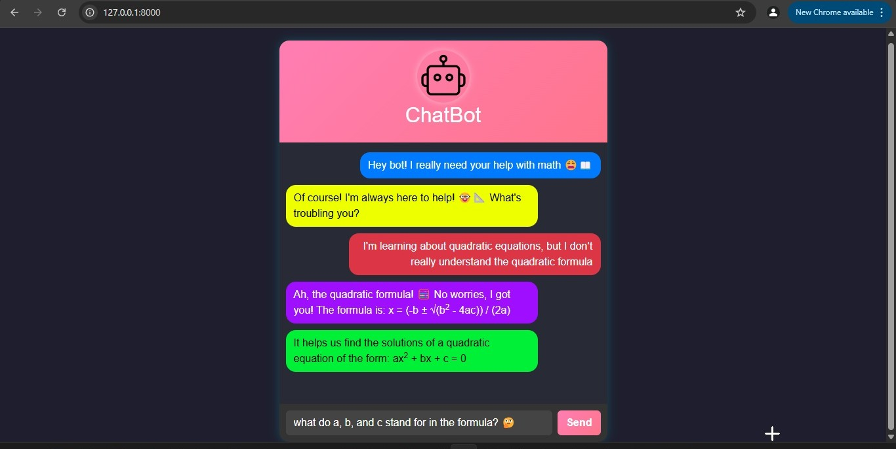

# Chatbot Application



A simple AI-powered chatbot application built with **FastAPI**, **Bootstrap**, and **OpenAI API**. The application can be run in two ways: **via Docker** or **locally with Python**.

---

## 🚀 Installation Methods

You can choose between two installation methods:
1. **Run with Docker** (Requires Docker Engine & Docker Compose)
2. **Run Locally with Python** (Requires Python 3.12.2+ and dependencies from `requirements.txt`)

---

## 🛠 Prerequisites

### 🔹 OpenAI API Key Requirement
To use this application, you must:
- **Create an OpenAI account** at [OpenAI Platform](https://platform.openai.com/).
- **Generate an API key** at [OpenAI API Keys](https://platform.openai.com/settings/organization/api-keys).
- **Add credits to your OpenAI account** at [OpenAI Billing](https://platform.openai.com/settings/organization/billing/overview).

### 🔹 Running with Docker
Ensure you have:
- **Docker Engine** installed ([Download Here](https://docs.docker.com/get-docker/))
- **Docker Compose** installed ([Installation Guide](https://docs.docker.com/compose/install/))

### 🔹 Running Locally (Without Docker)
Ensure you have:
- **Python 3.12.2+** installed ([Download Here](https://www.python.org/downloads/))
- Dependencies listed in `requirements.txt`

---

## 📌 Running the Application

### 🔹 Option 1: Running with Docker 🐳

1️⃣ **Clone the Repository**
```bash
git clone https://github.com/YOUR_GITHUB_USERNAME/YOUR_REPO_NAME.git
cd YOUR_REPO_NAME
```

2️⃣ **Build the Docker Image**
```bash
docker compose build
```

3️⃣ **Run the Container**
```bash
docker compose up -d
```

4️⃣ **Access the Application**
Open your browser and go to:
```
http://localhost:8000
```

5️⃣ **Stopping the Container**
```bash
docker compose down
```

---

### 🔹 Option 2: Running Locally (Without Docker) 🖥️

1️⃣ **Clone the Repository**
```bash
git clone https://github.com/YOUR_GITHUB_USERNAME/YOUR_REPO_NAME.git
cd YOUR_REPO_NAME
```

2️⃣ **Create a Virtual Environment**
```bash
python -m venv venv
source venv/bin/activate  # On Windows use: venv\Scripts\activate
```

3️⃣ **Install Dependencies**
```bash
pip install -r requirements.txt
```

4️⃣ **Run the Application**
```bash
python main.py
```

5️⃣ **Access the Application**
Open your browser and go to:
```
http://localhost:8000
```

---

## 📸 Application Preview


---

## 🔥 Features
✔ AI-powered chatbot using OpenAI API
✔ FastAPI backend for high performance
✔ Bootstrap frontend for a sleek UI
✔ Works with both **Docker** and **local Python installation**
✔ Easily customizable and extendable

---

## 📜 License
This project is **open-source** and available under the **MIT License**.

---

## 🤝 Contributing
Feel free to fork this project and submit a **pull request** with improvements or new features! 😊

---

## ⭐ Support
If you like this project, please give it a **star ⭐** on GitHub!

---

Happy coding bra! 🤙